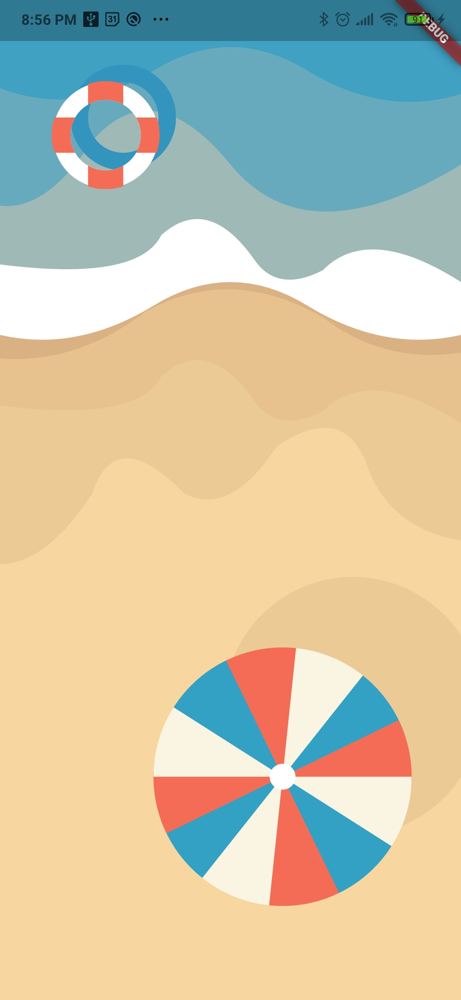

https://id.opf.dev.cloud.itau.com.br/testmobilepjredirectfase3 
 https://id.opf.hom.cloud.itau.com.br/opbconsentimento/mobilepj

# FlutterPlaygroundPath

Projeto destinado para pratica do Path.

## Beach

### FlutterPlayGroundPath/lib/beach/beach_page.dart
 O que foi feito:
 - Utilizado somente ClipPath e CustomPaint, ambos baseado em Path, resultado obtido na imagem a baixo;
 
 O que precisa fazer:
 - Melhorar o formato das ondas.
 - Aplicar animação.

 

